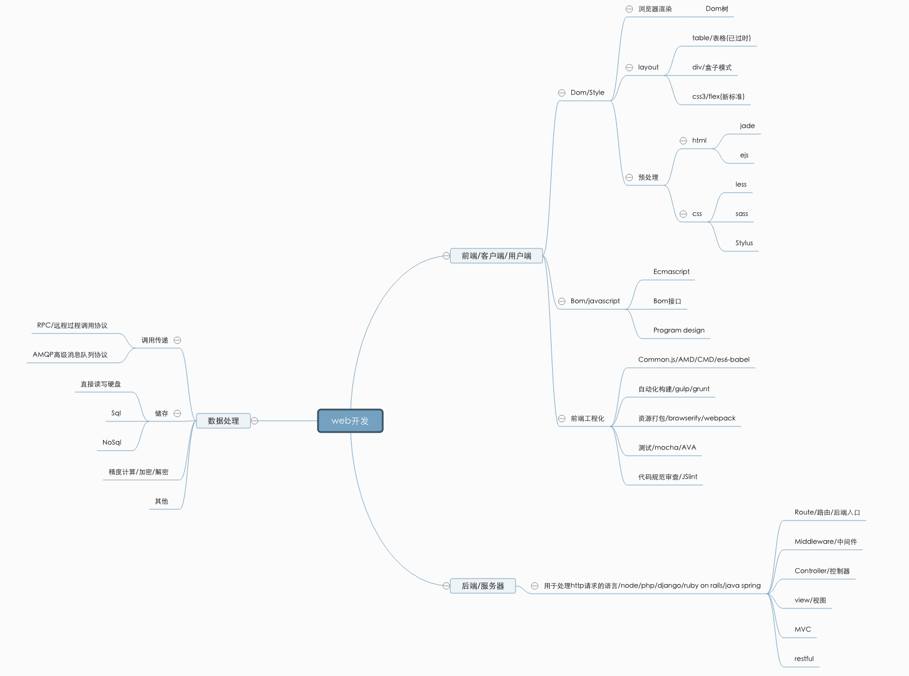

# lesson

# Youngon-lesson

## 前言

一些资料和教程目前只有web方面欢迎大家一起贡献代码

[思维导图](http://naotu.baidu.com/file/763b6840292f1a35bc250359723e3367?token=7273d18823b934e8)

## web路线

- [Html](./html/html.md)
   - [初识Html](./html/ImetHtml.md)
   - [HTML编码规范](./html/htmlStandards.md)
- [Css](./css/css.md)
   - [CSS 视频入门](http://www.imooc.com/learn/9)
   - [初识CSS](./css//ImetCSS.md)
   - [Css Transition](./Transition.md)
   - [Css Transform](./Transform.md)
   - [Box-sizing](./box-sizing.md)
- [layout](./layout/layout.md)
   - [CSS 盒子模型(Box Model)](./layout/Box-Model/Box-Model.md)
   - [BFC 块级格式化范围](./layout/BFC.md)
   - [Element in the middle(元素居中)](./layout/Element-middle.md)
   - [haslayout(ie 渲染引擎)](./layout/haslayout.md)
- [JavaScript](./JavaScript/JavaScript.md)
   - [标准参考教程](http://javascript.ruanyifeng.com/)
   - [ECMAScript 6](http://es6.ruanyifeng.com/)
   - [框架库大全](http://cnodejs.org/topic/56e8c95dcf7763a6045c4ae4)
   - [详解js闭包](https://segmentfault.com/a/1190000000652891)
   - [new 字符](./new.md)
- [Node.js](./Node/node.md)
   - [nrm - npm源切换管理](./Node/nrm.md)
   - [PM2 - 是一个带有负载均衡功能的 Node 应用的进程管理器](./Node/PM2.md)
   - [nvm - nodejs版本控制管理工具](./Node/nvm.md)
   - [mongodb](./Node/mongodb.md)
- [工具](./tool/tool.md)
   - [Git](./tool/git.md)
   - [终极 Shell——ZSH](./tool/oh my zsh.md)
   - [vagrant](,/tool/vagrant.md)
   - [Docker](./tool/Docker.md)

- [工作与学习](./WorkAndLearn/WorkAndLearn.md)
   - [Getting Things Done (把事情做完)](./GTD.md)
