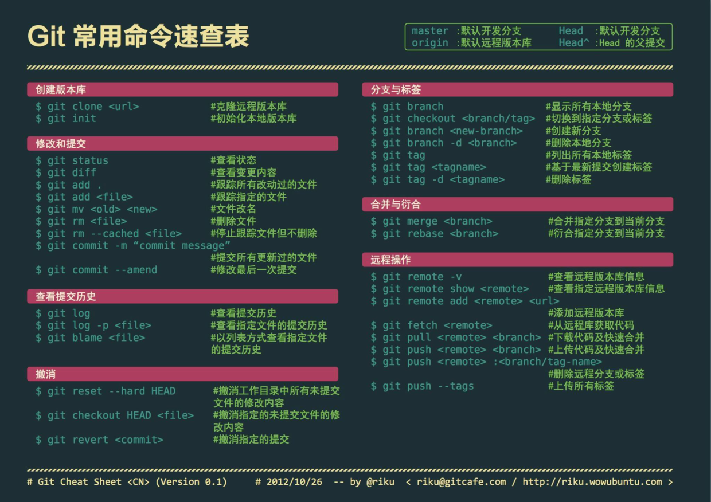

# Git

## 获取与创建项目

### git init
    通过git init命令把这个目录变成Git可以管理的仓库
### git clone [url]
    git clone [url]，[url] 为你想要克隆的项目.

## 基本操作

### git add  ``<file>``
    添加文件进入git列表

### git rm  ``<file>``
    删除git列表内的文件

### git commit / git commit -m 'xxx'
    现在你使用 git add 命令将想要快照的内容写入了缓存， 执行 git commit 就将它实际存储快照了。 Git 为你的每一个提交都记录你的名字与电子邮箱地址，所以第一步是告诉 Git 这些都是啥。
    我们使用.
    -m 选项以在命令行中提供提交注释。

### git push / git push [alias] [branch]
    提交到远程仓库分支

### git pull / git pull [alias] [branch]
    从远端仓库提取数据并尝试合并到当前分支

### git fetch
    从远端仓库下载新分支与数据

## 分支与合并

### git branch ``<branchname>``
    没有参数时，git branch 会列出你在本地的分支。你所在的分支的行首会有个星号作标记。
    有branchname 就是 创建一个分支

### git branch -d ``<branchname>``
    删除分支

### git checkout ``<branchname>``
    切换到名为branchname的分支
>git checkout -b ``<branchname>`` 创建新分支，并立即切换到它

## 检查与比较

### git log
    git log 找到你的项目历史中的特定提交 —— 按作者、日期、内容或者历史记录。

### git diff
    要查看两个提交快照的绝对改动，你可以用 git diff 命令。 这在两个主要情况中广为使用 —— 查看两个分支彼此之间的差值，和查看自发布或者某个旧历史点之后都有啥变了。让我们看看这俩情况。
